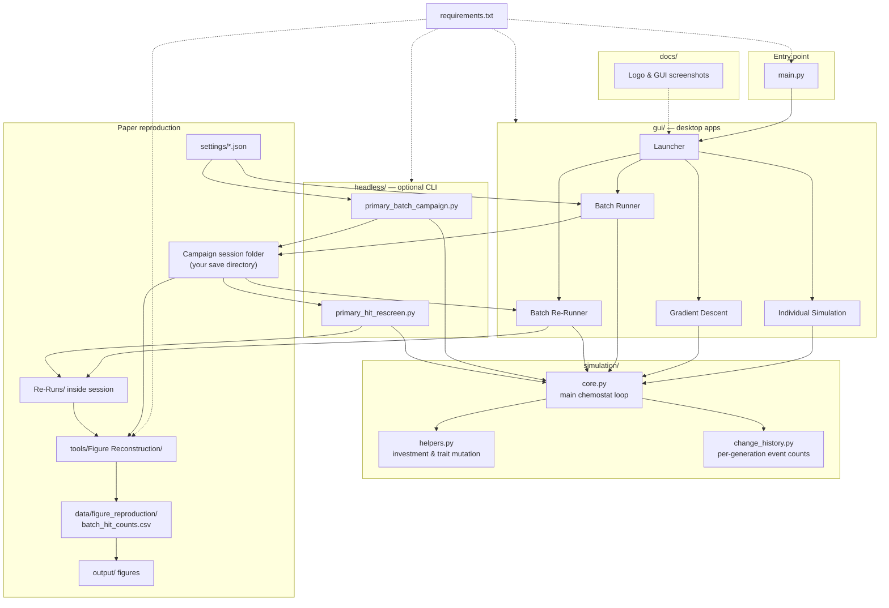

<div align="center">
  
  <h1 style="margin:0 0 10px;border:none;">Cross-Feeding Evolution</h1>
</div>

Simulate microbial evolution in a chemostat using the **MCCM** model (Minimal Cross-feeding Chemostat Model). This download includes four desktop apps for interactive runs, parameter search, and batch campaigns, plus optional command-line tools for batch runs and re-screening.

## Contents

- [About](#about)
- [Requirements](#requirements)
- [Install and run](#install-and-run)
- [Individual Simulation](#individual-simulation)
- [Gradient Descent Optimization](#gradient-descent-optimization)
- [Batch Runner](#batch-runner)
- [Batch Re-Runner](#batch-re-runner)
- [Batch campaigns from the terminal (optional)](#batch-campaigns-from-the-terminal-optional)
- [Re-screening from the terminal (optional)](#re-screening-from-the-terminal-optional)
- [Files in this download](#files-in-this-download)
- [Recreating the paper results](#recreating-the-paper-results)
- [Reconstructing paper figures](#reconstructing-paper-figures)
- [Correspondence](#correspondence)

## About

- **Version:** 1.1.5
- **Last updated:** 2026-07-28

This software was developed in the **Bergman Lab** at the **Department of Systems and Computational Biology**, Albert Einstein College of Medicine, Bronx, NY 10461, USA.

It implements the in silico chemostat evolution model used in *No Trade-Offs Required: Cross-Feeding From Survival Alone* (Samuel Rosean & Aviv Bergman).

Aviv Bergman is also affiliated with the Santa Fe Institute, Santa Fe, NM 87501, USA.

## Requirements

- **Python 3.11 or newer**
- **Tkinter** — required for the desktop GUIs. It usually comes with Python. If launching the GUI fails with a tkinter-related error, reinstall Python from [python.org](https://www.python.org/downloads/) and include Tcl/Tk in the install.

## Install and run

1. Unzip or copy this folder to wherever you want on your computer.
2. Open a terminal in **this folder** (the one that contains `main.py` and `requirements.txt`).
3. Install the listed packages:

   ```bash
   pip install -r requirements.txt
   ```

   Using a virtual environment in this folder is optional but recommended:

   ```bash
   python3 -m venv .venv
   source .venv/bin/activate
   pip install -r requirements.txt
   ```

   On Windows, activate with: `.venv\Scripts\activate`

4. Start the launcher:

   ```bash
   python main.py
   ```

Choose one of the four tools from the launcher window.

---

## Individual Simulation

Run one chemostat simulation at a time, inspect trajectories, and compute metrics on the final population.

<p align="center">
  
</p>

### Layout

- **Left column** — simulation parameters, toggles (diffusion, chemostat flow, death/duplication modes, traits), **Run Simulation**, and status/progress.
- **Center column** — tabbed plots. **Main Plots** shows trait heatmaps, population size, mean energy, metabolite flux, and deaths/duplications per generation. Other tabs add **M1 Metabolite**, **M2 Metabolite**, **Budgets**, and **Budget 2** detail views. The rightmost tab, **Metrics**, holds the metric selector, **Run** (score the last simulation), optional **Sweep Seeds** (repeat the same settings with different seeds), and seed-sweep output.
- **Right column** — diagnostic figures: death and duplication probability curves vs energy, the investment-function plot, and a **Simulation Pathway Diagram** that updates with your toggles.

### Typical workflow

1. Set **Number of Generations**, population size, inflow, and metabolic parameters in the scrollable sections.
2. Choose transport and life-cycle toggles (e.g. pooled vs diffusion-limited nutrients, binary vs constant death).
3. Optionally enter a **Random Seed** for reproducibility (leave blank for a random seed each run).
4. Click **Run Simulation** and wait for the progress bar to finish.
5. Browse the center tabs (**Main Plots** first, then M1/M2 or budget tabs as needed). Hover tooltips on labels explain individual knobs.
6. Open the **Metrics** tab, pick a metric, and click **Run** to score the finished run (e.g. task specialization, trait diversity).

Use this app to build intuition for a parameter set before scaling up to batch or optimization workflows.

---

## Gradient Descent Optimization

Search parameter space to improve a chosen metric using finite-difference gradient steps from multiple random starting points.

<p align="center">
  
</p>

### Layout

- **Left panel** — **Optimization Settings**, **Parameters to Optimize** (fix/unfix, min/max bounds), fixed parameter values, simulation toggles, and run buttons at the bottom (**Start**, **Pause**, **Stop**, **Parameter Heatmaps**, **Metric Histogram**, full-save controls).
- **Right panel** — **Optimization Results** scrollable log and the **Simulation Pathway Diagram**.

### Typical workflow

1. Choose the **Metric to Optimize** and **Optimization Goal** (maximize or minimize).
2. Under **Parameters to Optimize**, leave parameters unfixed and set min/max bounds for those you want the search to adjust; fix others at known values.
3. Set **Number of Random Starts** and **Gradient Descents per Start** (use 0 descents with 0 max iterations for random-start sampling only).
4. Adjust **Learning Rate**, **Gradient Step Size**, and **Max Iterations** as needed (tooltips describe each control).
5. Click **Set Full Save Folder** and choose where runs will be written (required before **Start**).
6. Click **Start** and monitor progress in **Optimization Results** and the progress bar.
7. When you have results, open **Metric Histogram** for histograms, filters, optional **UMAP (Clickable)** (needs `umap-learn`), and **Parameter Heatmaps (Filtered)**; or use **Parameter Heatmaps** for a simpler heatmap view.
8. To continue later, use **Load Dataset** or **Load Full Save Session**. Completed full-save runs also write offload batches and a session manifest under the folder from step 5.

Each metric evaluation may run several simulation replicates with derived seeds, so results can be noisy; increase **Number of Replicates** for smoother objectives.

---

## Batch Runner

Run many independent Monte Carlo batches over a parameter box and count how often simulations pass your metric filters (“hits”).

<p align="center">
  
</p>

### Layout

Two tabs:

- **Setup & metrics** — parameter panel (same style as optimization: fixed values vs sampled ranges), batch size, metric filters A–D, save folder, pathway diagram, and **Run Batch**.
- **Results** — hit-count violin plot, simulation event-rate chart, and **Parameter Heatmaps** after a campaign finishes or is loaded.

### Typical workflow

1. On **Setup & metrics**, set **Runs per batch (N)** and **Number of batches**.
2. In the parameter panel, mark which parameters are fixed and which are drawn uniformly from min/max bounds each simulation.
3. Configure **Metric A** (required) and optionally **B–C–D**; every active filter must pass for a hit (AND logic).
4. Click **Choose Save Folder** and pick where the campaign output will be written.
5. Click **Run Batch**. Use **Pause** / **Resume** (or type `pause` / `resume` in the terminal) for long jobs.
6. When complete, open the **Results** tab for hit-count and event-rate plots.
7. Optional: **Load JSON Settings** / **Save JSON Settings** for batch setup files; **Load Campaign Summary** reloads a finished session.

### Outputs (inside your save folder)

Each campaign creates a **session folder** with simulation offload batches, a campaign summary JSON (`primary_batch_campaign_<session>.json`), and—when there are hits—a hit-count CSV (`batch_hit_counts_<session>.csv`, or a configuration-slug variant). Keep that folder path for Batch Re-Runner or command-line re-screening.

---

## Batch Re-Runner

Re-test hits or non-hits from a finished Batch Runner campaign with fresh random seeds to estimate how often they pass the metric filters again.

<p align="center">
  
</p>

### Layout

- **Load campaign** (left) — **Choose Session Folder**, session id, and hit/non-hit counts.
- **Re-screen options** (left) — hits only, non-hits only, or both; seeds per point, worker count, optional deduplication of identical parameter vectors.
- **Loaded session** (right) — summary of metric filters and bounds from the original campaign.

### Typical workflow

1. Click **Choose Session Folder** and select the Batch Runner session directory (the folder that contains offload batches and the campaign summary JSON).
2. Confirm hit and non-hit counts in the status line.
3. Choose **Re-screen** mode (usually **Hits Only** first).
4. Set **Seeds per point (N)** — how many fresh simulations to run for each unique parameter vector (e.g. 20).
5. Click **Run Re-screen** and wait for completion.
6. Results are written under `Re-Runs/` (hits) or `Re-Runs-NonHits/` inside the session folder, and the session hit-count CSV is updated with re-screen statistics.

Use **Non-Hits Only** or **Both** to compare how often parameter sets that failed initially would pass on retry. Limit max non-hits when the non-hit pool is very large.

---

## Batch campaigns from the terminal (optional)

You can run a batch campaign without the GUI. Paper-ready settings are in `settings/` (see `settings/README.md`). From this folder:

```bash
python headless/primary_batch_campaign.py settings/Fixed_3_ratio/e_Death+Dup_Fixed_3.json --output-dir OUTPUT_FOLDER
```

You can also export a custom setup from the Batch Runner GUI with **Save JSON Settings**, then pass that file instead:
```bash
python headless/primary_batch_campaign.py SETTINGS.json --output-dir OUTPUT_FOLDER
```

Replace `OUTPUT_FOLDER` with the folder where you want the session written.

Optional flags:

- `--session-id NAME` — name the session (default: a timestamp)
- `--progress-every N` — print progress every N simulations per batch

The run creates the same kinds of outputs as the GUI: offload batches, a campaign summary JSON (`primary_batch_campaign_<session>.json`), and—when the campaign has hits—a per-hit CSV (`batch_hit_counts_<session>.csv`, or a configuration-slug variant).

---

## Re-screening from the terminal (optional)

After a batch campaign finishes, you can re-screen hits without the GUI. With your terminal still in this folder:

```bash
python headless/primary_hit_rescreen.py SESSION_FOLDER --n-seeds 20
python headless/primary_hit_rescreen.py SESSION_FOLDER --non-hits --max-hits 500
```

Replace `SESSION_FOLDER` with the batch session folder from Batch Runner or the headless batch runner.

Re-screen outputs are written inside that session folder under `Re-Runs/` or `Re-Runs-NonHits/`, and the session hit-counts CSV there is updated in place.

---

## Files in this download



**How to read this diagram**

- **`main.py`** opens the **launcher**, which starts one of four apps under **`gui/`**. Every app runs simulations through **`simulation/core.py`**, which uses **`helpers.py`** (investment and mutation) and **`change_history.py`** (deaths, duplications, flow, mutations per generation).
- **`settings/`** holds ready-made Batch Runner JSON files for the paper. Load them in **Batch Runner** or pass them to **`headless/primary_batch_campaign.py`** to write a **campaign session folder** on disk.
- **Batch Re-Runner** or **`headless/primary_hit_rescreen.py`** reads that session and writes **`Re-Runs/`** re-screen results back into it.
- **`tools/Figure Reconstruction/`** assembles campaign data into **`batch_hit_counts.csv`** and rebuilds the published figures under **`output/`**.
- **`docs/`** holds the Bergman Lab logo and GUI screenshots for this README; **`requirements.txt`** lists Python packages for everything above.

| Path | Role |
|------|------|
| `main.py` | Starts the GUI launcher |
| `requirements.txt` | Python packages (`pip install -r requirements.txt`) |
| `gui/` | Individual Simulation, Gradient Descent, Batch Runner, Batch Re-Runner |
| `simulation/__init__.py` | Python package marker |
| `simulation/core.py` | Main chemostat evolution loop (called by all apps and headless tools) |
| `simulation/helpers.py` | Investment function and trait mutation helpers used by `core.py` |
| `simulation/change_history.py` | Per-generation death, duplication, flow, and mutation counts |
| `headless/primary_batch_campaign.py` | Command-line batch campaigns |
| `headless/primary_hit_rescreen.py` | Command-line re-screening |
| `settings/` | Paper Batch Runner JSON settings (10 suites × 2 configurations) |
| `tools/Figure Reconstruction/` | Scripts to build `batch_hit_counts.csv` and regenerate paper figures |
| `docs/` | Bergman Lab logo and GUI screenshots for this README |

---

## Recreating the paper results

This section walks through recreating the paper’s **batch campaigns** (the Monte Carlo searches behind Fig. 3 and Supp. Fig. S2). Fig. 2’s schematic curves do not need these runs; see [Reconstructing paper figures](#reconstructing-paper-figures) for that.

### What you are reproducing

The paper compares two regimes across ten fixed task-energy yield ratios (Y):

| Regime | Settings file prefix | Example |
|--------|----------------------|---------|
| Neutral | `a_` | `settings/Fixed_3_ratio/a_trueNeutral_Fixed_3.json` |
| Death+Duplication | `e_` | `settings/Fixed_3_ratio/e_Death+Dup_Fixed_3.json` |

There are **20 settings files** in total (10 Y suites × 2 regimes). Each paper-scale file runs **100 batches × 1000 simulations**. Full details are in `settings/README.md`.

Pick one folder on disk to hold everything (call it `OUTPUT_ROOT`). Keeping all campaigns under that one root makes the figure scripts easy to run later.

### Step 1 — Run each batch campaign

For every JSON you need (all 20 for a full recreation):

**Option A — GUI**

1. Start the launcher (`python main.py`) and open **Batch Runner**.
2. Click **Load JSON Settings** and choose a file from `settings/` (for example `Fixed_3_ratio/e_Death+Dup_Fixed_3.json`).
3. Click **Choose Save Folder** and select your `OUTPUT_ROOT` (or a subfolder of it).
4. Click **Run Batch** and wait until it finishes.

**Option B — terminal** (same settings; useful on a cluster):

```bash
python headless/primary_batch_campaign.py \
  settings/Fixed_3_ratio/e_Death+Dup_Fixed_3.json \
  --output-dir OUTPUT_ROOT
```

Each finished campaign writes a **session folder** containing offload data, a campaign summary JSON, and—when there are hits—a hit-count CSV. Note that path; you need it for re-screening.

### Step 2 — Re-screen the hits

For each finished session that found hits:

**Option A — GUI**

1. Open **Batch Re-Runner** from the launcher.
2. Click **Choose Session Folder** and select that campaign’s session directory.
3. Leave mode on **Hits Only** (usual paper workflow).
4. Set **Seeds per point (N)** to **20** (paper value).
5. Click **Run Re-screen**.

**Option B — terminal:**

```bash
python headless/primary_hit_rescreen.py SESSION_FOLDER --n-seeds 20
```

Re-screen results are written inside that session under `Re-Runs/`.

Optional: also re-screen non-hits (`--non-hits` or the GUI **Non-Hits Only** / **Both** modes) if you want those comparisons.

### Step 3 — Repeat until you have what you need

- Full paper recreation: run Steps 1–2 for all **20** settings files.
- Smaller test: run a few suites first (the figure scripts will plot whatever Neutral / Death+Duplication data they find).

These campaigns are long. Once primary batches and re-screens are done, continue below to turn the outputs into figures.

---

## Reconstructing paper figures

Scripts live in `tools/Figure Reconstruction/`. They rebuild five manuscript figures:

| Output file | Figure | Needs campaign data? |
|-------------|--------|----------------------|
| `output/figures/mccm_chain.pdf` | Fig. 1 (MCCM chain) | No — LaTeX only |
| `output/figures/mccm_two_conditions.pdf` | Fig. 2 (two regimes) | No — LaTeX only |
| `output/figures/figure3_hit_panels.png` | Fig. 3 (hit counts + re-screen rates) | Yes |
| `output/figures/simulation_loop_combined.pdf` | Supp. Fig. S1 | No — LaTeX only |
| `output/supplementary/figures/supplementary_rescreen_ridgelines.png` | Supp. Fig. S2 (re-screen ridgelines) | Yes |

Figs. 3 and S2 read one assembled table, `data/figure_reproduction/batch_hit_counts.csv`. That file is **not** in the download; you build it from your `OUTPUT_ROOT`. Axis labels such as “out of N” follow the N stored in your data (for example 1000 for paper-scale runs).

### Requirements

- Python packages from `requirements.txt` (already installed if you followed [Install and run](#install-and-run)).
- For Figs. 1–2 and S1: **pdfLaTeX**, **latexmk**, and **pdfcrop**.
- For Figs. 3 and S2: finished campaigns + re-screens under one `OUTPUT_ROOT` ([Recreating the paper results](#recreating-the-paper-results)).

### Step 1 — Point the scripts at your campaigns

Open a terminal in this download’s root, then:

```bash
cd "tools/Figure Reconstruction"
export PYTHONPATH="scripts${PYTHONPATH:+:$PYTHONPATH}"
```

(`PYTHONPATH=scripts` lets the Python plot scripts import each other.)

Replace `/path/to/OUTPUT_ROOT` below with the folder that contains your campaign sessions.

### Step 2 — Build the figure data table

This does two jobs in order:

1. **Summarize** every Neutral / Death+Duplication session into one compare CSV, and copy each session’s `Re-Runs/` into a shared staging area.
2. **Assemble** that summary plus re-screens into `batch_hit_counts.csv`.

```bash
python3 scripts/build_summary_hit_counts.py --output-root /path/to/OUTPUT_ROOT
python3 scripts/assemble_figure_data.py --output-root /path/to/OUTPUT_ROOT
```

Or both at once:

```bash
python3 scripts/assemble_figure_data.py --output-root /path/to/OUTPUT_ROOT --build-summary
```

What you get:

| File | Meaning |
|------|---------|
| `OUTPUT_ROOT/Summary/Summary_Ratio/primary_batch_compare_hit_counts.csv` | Per-batch hit counts by suite and regime |
| `OUTPUT_ROOT/Re-Runs/sessions/` | Staged re-screen folders used by the assembler |
| `tools/Figure Reconstruction/data/figure_reproduction/batch_hit_counts.csv` | Unified table for Figs. 3 and S2 |

If you already have a `batch_hit_counts.csv`, you can place it at that last path and skip this step.

### Step 3 — Rebuild all figures

Still inside `tools/Figure Reconstruction/`:

```bash
./rebuild_all_figures.sh
```

Finished files land under `output/`. TikZ PDFs are also copied under `figures/Used/`.

To rebuild one figure only, run the matching script under `scripts/` (see `tools/Figure Reconstruction/README.md`, or pass `--help` to a plot script).

### If something is missing

- **Figs. 1, 2, or S1 fail:** install pdfLaTeX / latexmk / pdfcrop and try again.
- **Figs. 3 or S2 fail with a missing CSV:** finish Steps 1–2 above, or copy an existing `batch_hit_counts.csv` into `data/figure_reproduction/`.
- **Fig. 3 looks empty for some Y values:** that suite’s Neutral or Death+Duplication campaign (or its re-screen) is missing from `OUTPUT_ROOT`.

---

## Correspondence

**Correspondence:** Aviv Bergman — [aviv@einsteinmed.edu](mailto:aviv@einsteinmed.edu)

**Technical correspondence:** Samuel Rosean — [samuel.rosean@einsteinmed.edu](mailto:samuel.rosean@einsteinmed.edu)
