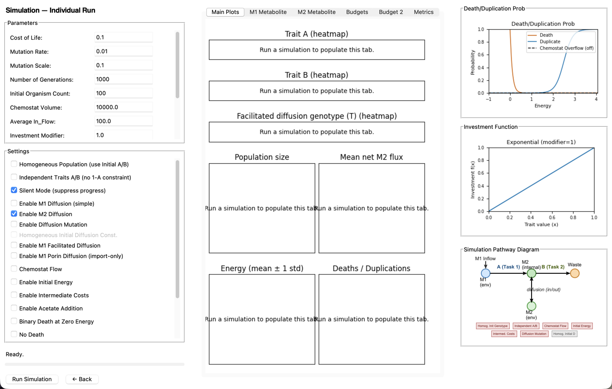
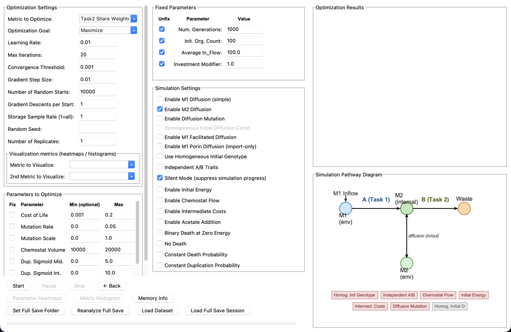
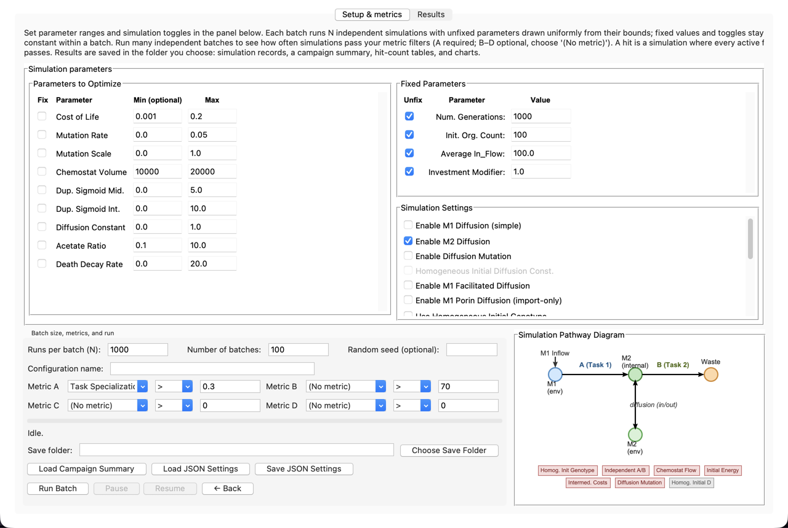
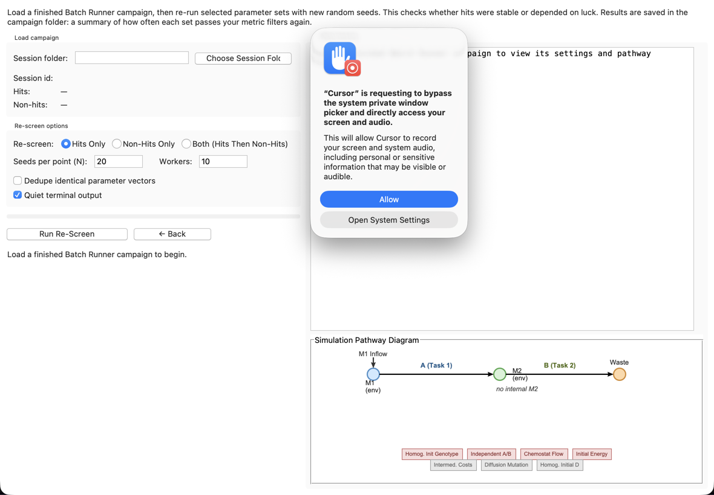
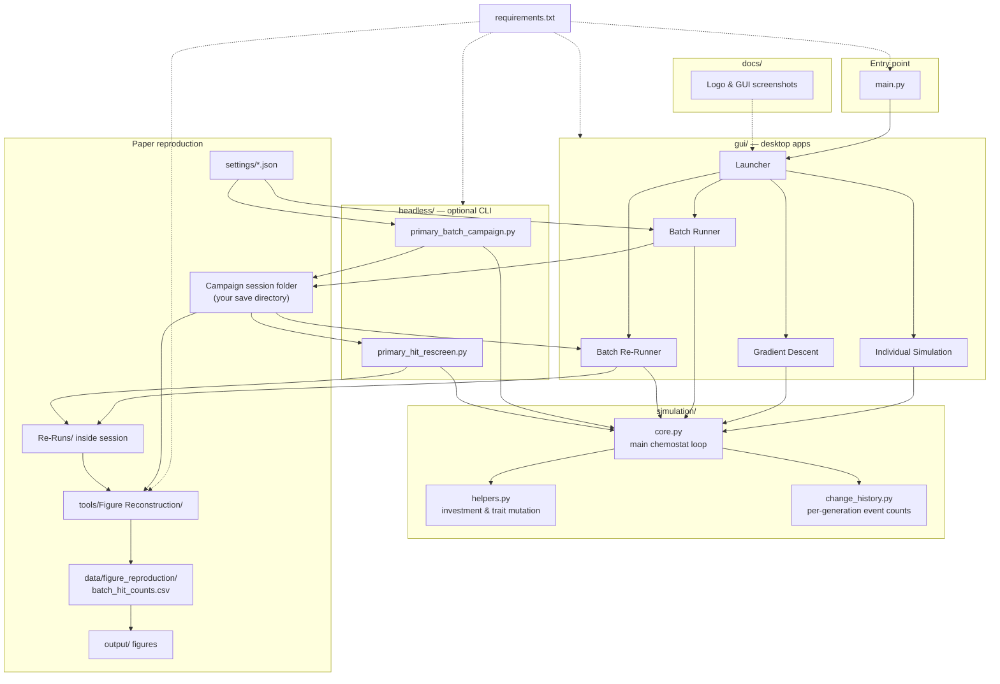

<div align="center">
  
  <h1 style="margin:0 0 10px;border:none;">Cross-Feeding Evolution</h1>
</div>

Simulate microbial evolution in a chemostat using the **MCCP** model (Minimal Chemostat Cross-feeding Problem). This download includes four desktop apps for interactive runs, parameter search, and batch campaigns, plus optional command-line tools for batch runs and re-screening.

## Contents

- [About](#about)
- [Requirements](#requirements)
- [Install and run](#install-and-run)
- [Individual Simulation](#individual-simulation)
- [Gradient Descent Optimization](#gradient-descent-optimization)
- [Batch Runner](#batch-runner)
- [Batch Re-Runner](#batch-re-runner)
- [Batch campaigns from the terminal (optional)](#batch-campaigns-from-the-terminal-optional)
- [Re-screening from the terminal (optional)](#re-screening-from-the-terminal-optional)
- [Files in this download](#files-in-this-download)
- [Recreating the paper results](#recreating-the-paper-results)
- [Reconstructing paper figures](#reconstructing-paper-figures)
- [Correspondence](#correspondence)

## About

This software was developed in the **Bergman Lab** at the **Department of Systems and Computational Biology**, Albert Einstein College of Medicine, Bronx, NY 10461, USA.

It implements the in silico chemostat evolution model used in *No Trade-Offs Required: Cross-Feeding From Survival Alone* (Samuel Rosean & Aviv Bergman).

Aviv Bergman is also affiliated with the Santa Fe Institute, Santa Fe, NM 87501, USA.

## Requirements

- **Python 3.11 or newer**
- **Tkinter** — required for the desktop GUIs. It usually comes with Python. If launching the GUI fails with a tkinter-related error, reinstall Python from [python.org](https://www.python.org/downloads/) and include Tcl/Tk in the install.

## Install and run

1. Unzip or copy this folder to wherever you want on your computer.
2. Open a terminal in **this folder** (the one that contains `main.py` and `requirements.txt`).
3. Install the listed packages:

   ```bash
   pip install -r requirements.txt
   ```

   Using a virtual environment in this folder is optional but recommended:

   ```bash
   python3 -m venv .venv
   source .venv/bin/activate
   pip install -r requirements.txt
   ```

   On Windows, activate with: `.venv\Scripts\activate`

4. Start the launcher:

   ```bash
   python main.py
   ```

Choose one of the four tools from the launcher window.

---

## Individual Simulation

Run one chemostat simulation at a time, inspect trajectories, and compute metrics on the final population.

<p align="center">
  
</p>

### Layout

- **Left column** — simulation parameters, toggles (diffusion, chemostat flow, death/duplication modes, traits), **Run Simulation**, and status/progress.
- **Center column** — tabbed plots. **Main Plots** shows trait heatmaps, population size, mean energy, metabolite flux, and deaths/duplications per generation. Other tabs add **M1 Metabolite**, **M2 Metabolite**, **Budgets**, and **Budget 2** detail views. The rightmost tab, **Metrics**, holds the metric selector, **Run** (score the last simulation), optional **Sweep Seeds** (repeat the same settings with different seeds), and seed-sweep output.
- **Right column** — diagnostic figures: death and duplication probability curves vs energy, the investment-function plot, and a **Simulation Pathway Diagram** that updates with your toggles.

### Typical workflow

1. Set **Number of Generations**, population size, inflow, and metabolic parameters in the scrollable sections.
2. Choose transport and life-cycle toggles (e.g. pooled vs diffusion-limited nutrients, binary vs constant death).
3. Optionally enter a **Random Seed** for reproducibility (leave blank for a random seed each run).
4. Click **Run Simulation** and wait for the progress bar to finish.
5. Browse the center tabs (**Main Plots** first, then M1/M2 or budget tabs as needed). Hover tooltips on labels explain individual knobs.
6. Open the **Metrics** tab, pick a metric, and click **Run** to score the finished run (e.g. task specialization, trait diversity).

Use this app to build intuition for a parameter set before scaling up to batch or optimization workflows.

---

## Gradient Descent Optimization

Search parameter space to improve a chosen metric using finite-difference gradient steps from multiple random starting points.

<p align="center">
  
</p>

### Layout

- **Left panel** — **Optimization Settings**, **Parameters to Optimize** (fix/unfix, min/max bounds), fixed parameter values, simulation toggles, and run buttons at the bottom (**Start**, **Pause**, **Stop**, **Parameter Heatmaps**, **Metric Histogram**, full-save controls).
- **Right panel** — **Optimization Results** scrollable log and the **Simulation Pathway Diagram**.

### Typical workflow

1. Choose the **Metric to Optimize** and **Optimization Goal** (maximize or minimize).
2. Under **Parameters to Optimize**, leave parameters unfixed and set min/max bounds for those you want the search to adjust; fix others at known values.
3. Set **Number of Random Starts** and **Gradient Descents per Start** (use 0 descents with 0 max iterations for random-start sampling only).
4. Adjust **Learning Rate**, **Gradient Step Size**, and **Max Iterations** as needed (tooltips describe each control).
5. Click **Set Full Save Folder** and choose where runs will be written (required before **Start**).
6. Click **Start** and monitor progress in **Optimization Results** and the progress bar.
7. When you have results, open **Metric Histogram** for histograms, filters, optional **UMAP (Clickable)** (needs `umap-learn`), and **Parameter Heatmaps (Filtered)**; or use **Parameter Heatmaps** for a simpler heatmap view.
8. To continue later, use **Load Dataset** or **Load Full Save Session**. Completed full-save runs also write offload batches and a session manifest under the folder from step 5.

Each metric evaluation may run several simulation replicates with derived seeds, so results can be noisy; increase **Number of Replicates** for smoother objectives.

---

## Batch Runner

Run many independent Monte Carlo batches over a parameter box and count how often simulations pass your metric filters (“hits”).

<p align="center">
  
</p>

### Layout

Two tabs:

- **Setup & metrics** — parameter panel (same style as optimization: fixed values vs sampled ranges), batch size, metric filters A–D, save folder, pathway diagram, and **Run Batch**.
- **Results** — hit-count violin plot, simulation event-rate chart, and **Parameter Heatmaps** after a campaign finishes or is loaded.

### Typical workflow

1. On **Setup & metrics**, set **Runs per batch (N)** and **Number of batches**.
2. In the parameter panel, mark which parameters are fixed and which are drawn uniformly from min/max bounds each simulation.
3. Configure **Metric A** (required) and optionally **B–C–D**; every active filter must pass for a hit (AND logic).
4. Click **Choose Save Folder** and pick where the campaign output will be written.
5. Click **Run Batch**. Use **Pause** / **Resume** (or type `pause` / `resume` in the terminal) for long jobs.
6. When complete, open the **Results** tab for hit-count and event-rate plots.
7. Optional: **Load JSON Settings** / **Save JSON Settings** for batch setup files; **Load Campaign Summary** reloads a finished session.

### Outputs (inside your save folder)

Each campaign creates a **session folder** with simulation offload batches, a campaign summary JSON (`primary_batch_campaign_<session>.json`), and a hit-count CSV (`batch_hit_counts_<session>.csv`, or similar). Keep that folder path for Batch Re-Runner or command-line re-screening.

---

## Batch Re-Runner

Re-test hits or non-hits from a finished Batch Runner campaign with fresh random seeds to estimate how often they pass the metric filters again.

<p align="center">
  
</p>

### Layout

- **Load campaign** (left) — **Choose Session Folder**, session id, and hit/non-hit counts.
- **Re-screen options** (left) — hits only, non-hits only, or both; seeds per point, worker count, optional deduplication of identical parameter vectors.
- **Loaded session** (right) — summary of metric filters and bounds from the original campaign.

### Typical workflow

1. Click **Choose Session Folder** and select the Batch Runner session directory (the folder that contains offload batches and the campaign summary JSON).
2. Confirm hit and non-hit counts in the status line.
3. Choose **Re-screen** mode (usually **Hits Only** first).
4. Set **Seeds per point (N)** — how many fresh simulations to run for each unique parameter vector (e.g. 20).
5. Click **Run Re-screen** and wait for completion.
6. Results are written under `Re-Runs/` (hits) or `Re-Runs-NonHits/` inside the session folder, and the session hit-count CSV is updated with re-screen statistics.

Use **Non-Hits Only** or **Both** to compare how often parameter sets that failed initially would pass on retry. Limit max non-hits when the non-hit pool is very large.

---

## Batch campaigns from the terminal (optional)

You can run a batch campaign without the GUI. Paper-ready settings are in `settings/` (see `settings/README.md`). From this folder:

```bash
python headless/primary_batch_campaign.py settings/Fixed_3_ratio/c_justDeath_Fixed_3.json --output-dir OUTPUT_FOLDER
```

You can also export a custom setup from the Batch Runner GUI with **Save JSON Settings**, then pass that file instead:
```bash
python headless/primary_batch_campaign.py SETTINGS.json --output-dir OUTPUT_FOLDER
```

Replace `OUTPUT_FOLDER` with the folder where you want the session written.

Optional flags:

- `--session-id NAME` — name the session (default: a timestamp)
- `--progress-every N` — print progress every N simulations per batch

The run creates the same kinds of outputs as the GUI: offload batches, a hit-count CSV, and `primary_batch_campaign_<session>.json` inside `OUTPUT_FOLDER`.

---

## Re-screening from the terminal (optional)

After a batch campaign finishes, you can re-screen hits without the GUI. With your terminal still in this folder:

```bash
python headless/primary_hit_rescreen.py SESSION_FOLDER --n-seeds 20
python headless/primary_hit_rescreen.py SESSION_FOLDER --non-hits --max-hits 500
```

Replace `SESSION_FOLDER` with the batch session folder from Batch Runner or the headless batch runner.

Re-screen outputs are written inside that session folder under `Re-Runs/` or `Re-Runs-NonHits/`, and the session hit-counts CSV there is updated in place.

---

## Files in this download



**How to read this diagram**

- **`main.py`** opens the **launcher**, which starts one of four apps under **`gui/`**. Every app runs simulations through **`simulation/core.py`**, which uses **`helpers.py`** (investment and mutation) and **`change_history.py`** (deaths, duplications, flow, mutations per generation).
- **`settings/`** holds ready-made Batch Runner JSON files for the paper. Load them in **Batch Runner** or pass them to **`headless/primary_batch_campaign.py`** to write a **campaign session folder** on disk.
- **Batch Re-Runner** or **`headless/primary_hit_rescreen.py`** reads that session and writes **`Re-Runs/`** re-screen results back into it.
- **`tools/Figure Reconstruction/`** assembles campaign data into **`batch_hit_counts.csv`** and rebuilds the published figures under **`output/`**.
- **`docs/`** holds the Bergman Lab logo and GUI screenshots for this README; **`requirements.txt`** lists Python packages for everything above.

| Path | Role |
|------|------|
| `main.py` | Starts the GUI launcher |
| `requirements.txt` | Python packages (`pip install -r requirements.txt`) |
| `gui/` | Individual Simulation, Gradient Descent, Batch Runner, Batch Re-Runner |
| `simulation/__init__.py` | Python package marker |
| `simulation/core.py` | Main chemostat evolution loop (called by all apps and headless tools) |
| `simulation/helpers.py` | Investment function and trait mutation helpers used by `core.py` |
| `simulation/change_history.py` | Per-generation death, duplication, flow, and mutation counts |
| `headless/primary_batch_campaign.py` | Command-line batch campaigns |
| `headless/primary_hit_rescreen.py` | Command-line re-screening |
| `settings/` | Paper Batch Runner JSON settings (7 suites × 4 configurations) |
| `tools/Figure Reconstruction/` | Scripts to build `batch_hit_counts.csv` and regenerate paper figures |
| `docs/` | Bergman Lab logo and GUI screenshots for this README |

---

## Recreating the paper results

The paper compares four regimes (Neutral, Differential Death, Differential Reproduction, and Differential Death and Duplication) across fixed task-energy yield ratios.

**All Batch Runner JSON settings used in the paper are included in the `settings/` folder** — one file per suite and configuration (e.g. `settings/Fixed_3_ratio/c_justDeath_Fixed_3.json`). See `settings/README.md` for the full list of suites and config names.

You can reproduce the workflow with two apps:

1. **Batch Runner** — Open a JSON from `settings/` via **Load JSON Settings**, choose a save folder, and run the campaign. Each file runs 100 batches of 1000 simulations with the paper’s metric filters and parameter bounds. Session output includes hit counts and the parameter vectors that hit.

2. **Batch Re-Runner** — Load a finished Batch Runner session and **re-screen hits** (and optionally non-hits) with fresh random seeds. The paper used 20 re-screen seeds per hit to estimate how often the same parameter set passes again. Results are written under `Re-Runs/` inside the session folder.

Repeat steps 1–2 for each JSON in `settings/` that you need (seven fixed yield-ratio suites × four configurations). Large campaigns are long-running; the same JSON files work with the headless batch runner on a cluster (see `settings/README.md` and [Batch campaigns from the terminal (optional)](#batch-campaigns-from-the-terminal-optional)). Once you have primary batches and re-screens, the [figure reconstruction scripts](#reconstructing-paper-figures) can turn those outputs into plots.

## Reconstructing paper figures

Figure-reconstruction scripts live in `tools/Figure Reconstruction/`. They regenerate the five figures in the main manuscript and Supplementary Information PDF (Figs. 1–3 and Supp. Figs. S1–S2) from a single table, `batch_hit_counts.csv`.

**Typical workflow:**

1. Complete Batch Runner campaigns and Batch Re-Runner re-screens for the configurations you need (see [Recreating the paper results](#recreating-the-paper-results)).
2. Build `batch_hit_counts.csv` and place it under `tools/Figure Reconstruction/data/figure_reproduction/`.

   Finished campaigns must be collected in the aggregated output layout that `assemble_figure_data.py` expects: a summary table at `Summary/Summary_Ratio/primary_batch_compare_hit_counts.csv` and re-screen exports under `Re-Runs/sessions/` (plus `Re-Runs-NonHits/sessions/` if non-hit re-screens were run). From this folder:

   ```bash
   cd "tools/Figure Reconstruction"
   export PYTHONPATH="scripts${PYTHONPATH:+:$PYTHONPATH}"
   python3 scripts/assemble_figure_data.py
   ```

   See `tools/Figure Reconstruction/README.md` for details.

3. Rebuild figures:

   ```bash
   ./rebuild_all_figures.sh
   ```

   Outputs appear under `output/`. TikZ schematic PDFs are also written under `figures/Used/`.

**Requirements for figures:** Python packages from `requirements.txt`, plus **pdfLaTeX**, **latexmk**, and **pdfcrop** for the TikZ schematics. See `tools/Figure Reconstruction/README.md` for the full output list and individual script options.

---

## Correspondence

**Correspondence:** Aviv Bergman — [aviv@einsteinmed.edu](mailto:aviv@einsteinmed.edu)

**Technical correspondence:** Samuel Rosean — [samuel.rosean@einsteinmed.edu](mailto:samuel.rosean@einsteinmed.edu)
